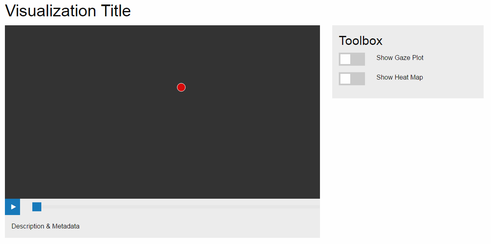

Final Project - Interactive Data Visualization  
===

## Collaboration

- Chris Chagnon - cjchagnon - cjchagnon@wpi.edu
- Jeffrey Estrada - jestradaramos - jestrada@wpi.edu
- Tiffany Vo - ttranvo - ttvo@wpi.edu

We worked on this project's design and ideation as a group; Jeffrey worked on the Gaze plot and Eye Visualization, Tiffany worked on the heat map, and Chris worked on making them interactive in the player format.

## Libraries and code
- The Visualziations were drawn in D3 V3;
- We used FontAwesome, jQuery, and Foundation to help build the pages and interactivity.
- We referenced the following code to make ours
<ul>
  <li><a href="https://codepen.io/pedrocampos/pen/ADdtl">Pedro Campos - Eye CSS</a></li>
  <li><a href="http://bl.ocks.org/mbostock/3202354">Mike Bostock - Heatmaps in d3</a></li>
  <li><a href="http://bl.ocks.org/weiglemc/6185069">Michele Weigle - Scatterplots in d3</a></li>
</ul>

## Overview

Eyetracker.js provides User Experience Designers and Technicians with the ability to share their data in an interactive way that is familiar to their users.

## Links
[About Site](https://cjchagnon.github.io/DataVisFinal/site/)
[The Tool](https://cjchagnon.github.io/DataVisFinal/site/vis.html)
[Git](https://github.com/cjchagnon/DataVisFinal)
[Process Book](resources/docs/Process-Book.pdf Process Book)
[Screencast Video](https://www.youtube.com/watch?v=61Ygqr_c7QQ)

## Feature Walk Through
- The Stage - shows the image that was tracked, and the overlay of the eye data visualizations.
- The Playback Bar - allows for nuanced control over the autoplay, and scrubbing through the data playback.
- The Toolbox - the toolbox enables or disables the visualization overlays for gaze plot and heat map.

## Design and Technical Innovtions and Future work
- The modular design of the functions allows for them to be instanced and called upon for updates, removal, and initial draw in an easy manner.
- The playback steps through each and every datum.
- The heatmap function is a huge departure from the documented examples that exist for D3.
- Variables were created for many of the different options to allow for future features to be added as needed, or if requested, this ranges from color options, to grid size and resolution options.
- The design needs to be responsive, which requires redrawing the domain/range on resize.
- This is a great proof of concept, but the power of this tool is in creating sharable items, so managing uploads, and creating sharable links for each upload is something that would add great pwoer to this tool.
