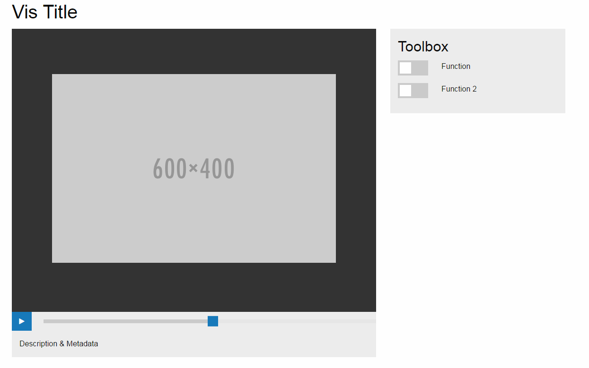
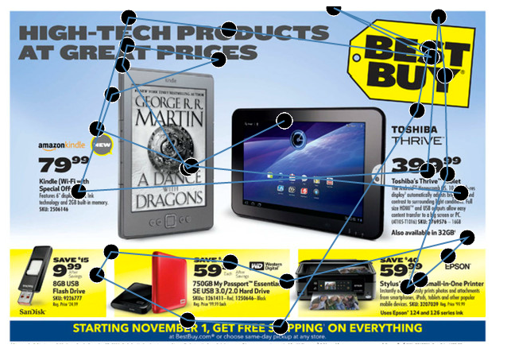

Final Project - Prototype Presentation & Feedback
===

For this week we focused on getting our ideas in order and making sure out scope was achievable. This meant getting the site design and layout squared away and our main visualizations coded or started.

We gathered extensive data, and despite our initial analysis we realized that we do not need every column, so we have spent time cleaning up data as well as researching what the columns truely mean before we continue visualizing them.

## Feedback

In our class session we recieved lots of new ideas that we would like to eventually do, but also some new techniques that may help us in achieving our short term goals.

Some items of note:
- We need to manage our scope, we have a lot of ideas but need to focus on some of them not all of them.
- This is not a youtube for eyetracking, but more of a codepen for tracking data. Our content should be sharable, but our platform should not (initially) focus on providing context, but rather something linkable or even embeddable.
- We need to add numbers to the gaze plot to show sequence.
- We can add index numbers to the gaze plot for clarity, and maybe a way to search or find specific plot points.
- Responsive design may be very difficult to do for this because of the SVG width.

## Working Prototype

[Link to Prototype](https://cjchagnon.github.io/DataVisFinal/site)
## Gaze Plot

[Link to Vis](https://cjchagnon.github.io/DataVisFinal)
